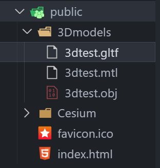

主要是使用 Vue 提交到 github page 怎么搞，可以看那个 CSDN 博客，那里面中间有个路由的操作，我现在还不懂路由是什么，不过如果你没有使用的话可以跳过

### 模型路径问题：

我在 public 文件夹下放了我的测试模型，之后在任何组件里，如果你要引用 public 里的资源，只能使用如下的相对路径：

```js
 uri: '3Dmodels/3dtest.gltf',  // 模型文件路径
```

不然打包后就不能正常显示了

